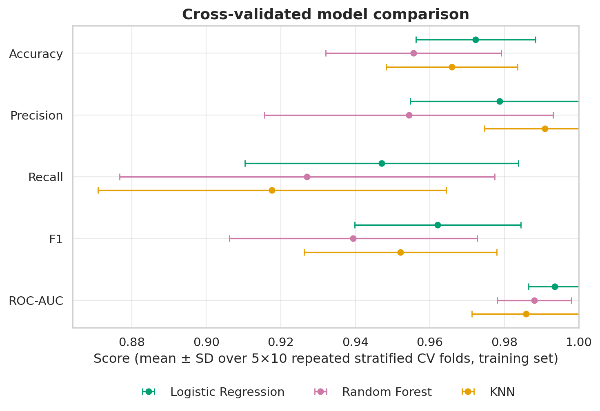
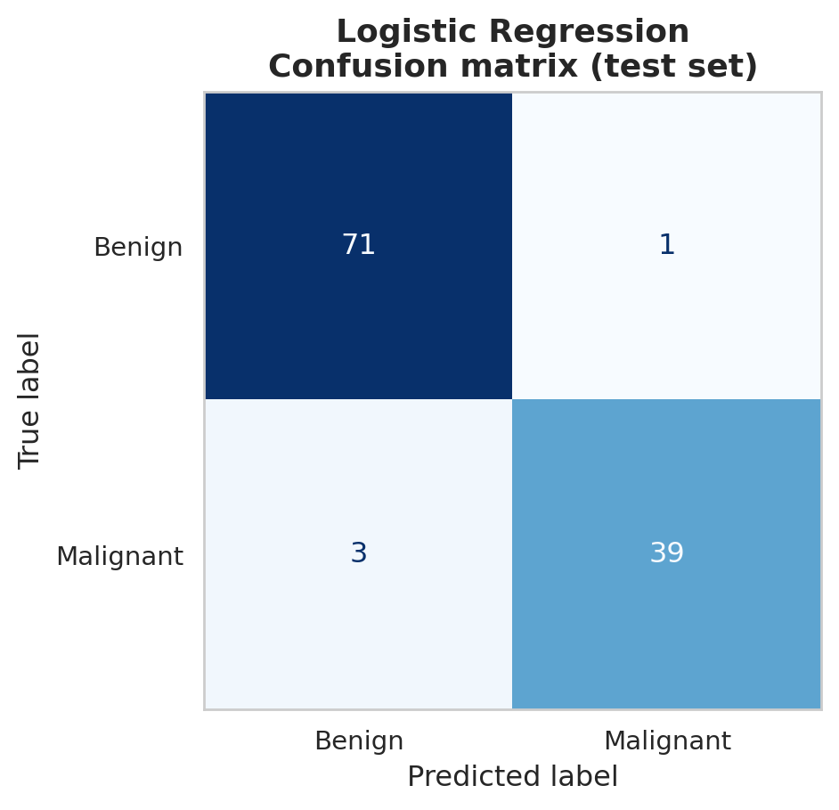
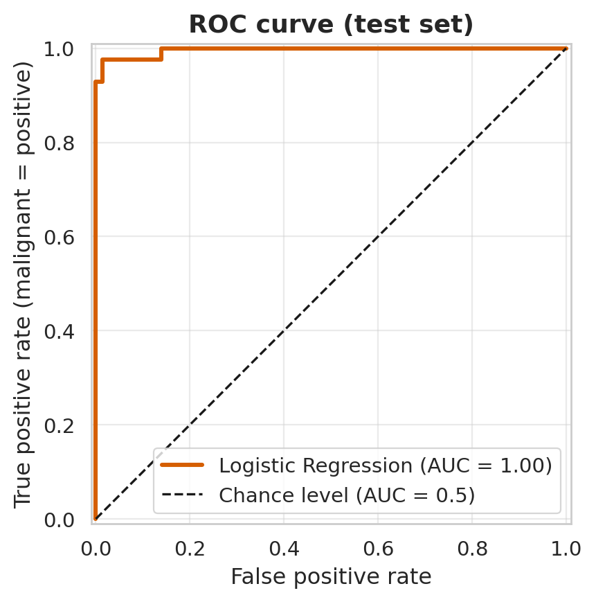
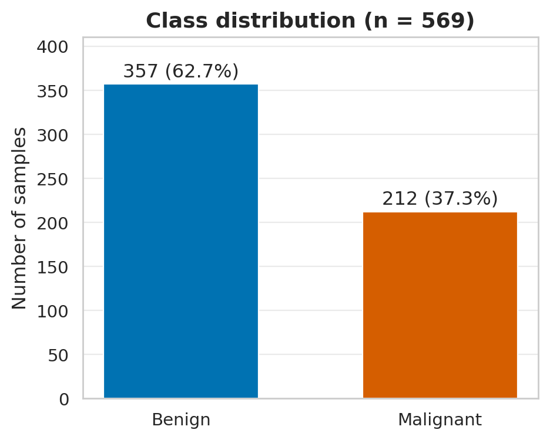
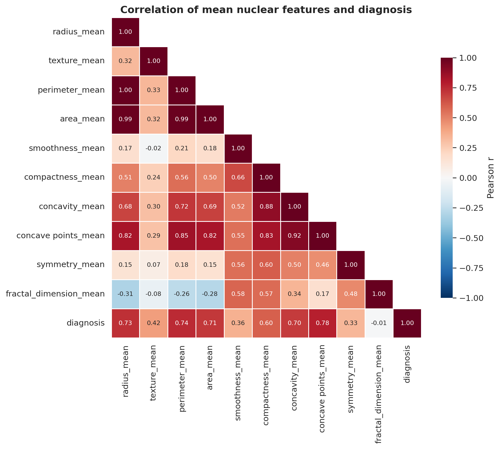

# Comparative Study of Machine Learning Algorithms for Breast Cancer Classification

[](https://www.python.org/)
[](LICENSE)
[]()
A reproducible scikit-learn workflow that classifies breast masses as **benign or malignant**
from nuclear features computed on fine-needle-aspirate (FNA) images, using the
Breast Cancer Wisconsin (Diagnostic) dataset. Three classifiers are compared with repeated
stratified cross-validation; the selected model is evaluated once on a held-out test set.

> **Disclaimer:** this project is for educational/research purposes and is **not a clinical diagnostic system**.

---

## Key results

**Cross-validated comparison** — training set (n = 455), 5-fold × 10 repeats, mean over 50 folds:

| Model | Accuracy | Precision | Recall | F1 | ROC-AUC |
|-------|---------:|----------:|-------:|---:|--------:|
| **Logistic Regression** | **0.972** | 0.979 | **0.947** | **0.962** | **0.994** |
| KNN (k = 7) | 0.966 | **0.991** | 0.918 | 0.952 | 0.986 |
| Random Forest (300 trees) | 0.956 | 0.954 | 0.927 | 0.939 | 0.988 |

Malignant is the positive class. Standard deviations across folds (e.g. ROC-AUC: 0.007 / 0.015 / 0.010) are
in [`results/metrics/cv_results.csv`](results/metrics/cv_results.csv). The models differ by roughly one fold-SD
or less on most metrics, so the ranking should be read as *suggestive, not conclusive*.

**Held-out test set** — Logistic Regression (highest mean CV ROC-AUC), n = 114 (72 benign, 42 malignant):

| ROC-AUC | Accuracy | Precision (malignant) | Recall (malignant) | F1 (malignant) |
|--------:|---------:|----------------------:|-------------------:|---------------:|
| 0.996 | 0.965 | 0.975 | 0.929 | 0.951 |

Confusion matrix: 71 true benign, 1 false positive, **3 false negatives**, 39 true malignant.
(Accuracy, precision, recall and F1 are computed from these counts; the 95 % exact binomial
interval for malignant recall, 39/42, is 0.81–0.99, which shows how uncertain a 114-sample test set is.)

<p align="center">
  
</p>
<p align="center">
  
  
</p>

---

## Project overview

* **Problem:** binary classification of a breast mass as benign (0) or malignant (1) from 30 numeric features.
* **Data:** Breast Cancer Wisconsin (Diagnostic), 569 samples — see [Dataset](#dataset).
* **Models:** Logistic Regression, k-Nearest Neighbours, Random Forest.
* **Emphasis:** leakage-free preprocessing (scaling inside a `Pipeline`), a test set that is touched once,
  and honest reporting of variability.
* **Why it matters:** in a diagnostic setting, missing a malignant case (false negative) is costlier than
  flagging a benign one, so recall is reported alongside accuracy and ROC-AUC.

## Methodology

```text
Kaggle/UCI CSV
   ↓  drop id + empty column, encode M/B → 1/0, validate
Exploratory analysis (class balance, correlations, feature distributions)
   ↓
Stratified 80/20 train/test split (seed 42)
   ↓
Repeated stratified 5×10 CV on the training set
   ↓  (scaler is fitted inside each training fold)
Select model by mean ROC-AUC
   ↓
Refit on full training set → evaluate ONCE on the test set
```

Full details: [`docs/methodology.md`](docs/methodology.md).

## Dataset

| | |
|---|---|
| Name | Breast Cancer Wisconsin (Diagnostic) |
| Source | UCI ML Repository ([doi:10.24432/C5DW2B](https://doi.org/10.24432/C5DW2B)); copy used here: [Kaggle mirror](https://www.kaggle.com/datasets/uciml/breast-cancer-wisconsin-data) |
| Samples / features | 569 / 30 (10 nuclear characteristics × mean, standard error, worst) |
| Target | `diagnosis`: M (malignant) → 1 (212, 37.3 %), B (benign) → 0 (357, 62.7 %) |
| Missing values | none |
| Preprocessing | drop `id` and the empty `Unnamed: 32` column; encode target |

The data are **not committed**; download instructions are in [`data/README.md`](data/README.md).

<p align="center">
  
  
</p>

The heatmap shows near-perfect collinearity between radius, perimeter and area (r ≈ 0.99–1.00), and that
`concave points_mean`, `perimeter_mean`, `radius_mean` and `area_mean` correlate most strongly with the diagnosis (r ≈ 0.71–0.78).

## Models

| Model | Why included | Key hyperparameters | Preprocessing |
|---|---|---|---|
| Logistic Regression | Strong, interpretable baseline for tabular binary data | `max_iter=2000`, defaults otherwise (L2, C = 1) | StandardScaler |
| k-Nearest Neighbours | Distance-based, non-parametric contrast | `n_neighbors=7` | StandardScaler |
| Random Forest | Ensemble that can capture non-linear structure | `n_estimators=300` | none (scale-invariant) |

All hyperparameters were fixed in advance; **no hyperparameter search was run**. Training and evaluation
procedure: see [Methodology](#methodology).

## Evaluation

* **Accuracy** — share of correct predictions; can hide errors on the smaller class.
* **Precision** — of the cases flagged malignant, how many truly are.
* **Recall (sensitivity)** — of the truly malignant cases, how many are caught. The most clinically relevant error is a missed malignancy.
* **F1** — harmonic mean of precision and recall.
* **ROC-AUC** — threshold-independent measure of how well the model ranks malignant above benign; used to select the model.
* **Confusion matrix** — the raw counts behind all threshold-based metrics.

## Computational cost (secondary result)

In the original notebook run (Google Colab), the 50-fit cross-validation took 9.7 s (Logistic Regression),
2.2 s (KNN) and 46.9 s (Random Forest). Random Forest is consistently the slowest; the other two are close and the
exact ratio depends on the machine. A NumPy-vs-pandas group-mean micro-benchmark is included in the notebook
(NumPy ≈ 8× faster on the 569-row data, shrinking to ≈ 1.2× on 100,000 resampled rows). Re-run
`python -m src.train` for timings on your hardware (`results/metrics/cv_results.csv`).

## Reproducibility

```bash
git clone https://github.com/RomdhaneNamji/breast-cancer-classification-wdbc.git
cd breast-cancer-classification-wdbc

python -m venv .venv
source .venv/bin/activate          # Windows: .venv\Scripts\activate
pip install -r requirements.txt

python -m src.download_data        # -> data/raw/data.csv
python -m src.eda                  # EDA figures
python -m src.train                # repeated CV, model selection, fits best model
python -m src.evaluate             # one-time test-set evaluation + figures
pytest                             # optional: run the test suite
```

Outputs appear in `results/figures/` and `results/metrics/`. To follow the narrative
version, open `notebooks/breast_cancer_detection.ipynb` with `jupyter lab`.
Every random component uses seed 42 (`src/config.py`).

## Project structure

```text
.
├── README.md
├── LICENSE
├── requirements.txt
├── environment.yml            # optional conda environment
├── pytest.ini
├── data/
│   ├── README.md              # source, licence, download instructions
│   ├── raw/                   # data.csv goes here (git-ignored)
│   └── processed/
├── notebooks/
│   └── breast_cancer_detection.ipynb
├── src/
│   ├── config.py              # paths, seed, CV settings
│   ├── data.py                # load / clean / validate / split
│   ├── models.py              # model definitions
│   ├── plots.py               # figure functions, one shared style
│   ├── eda.py  train.py  evaluate.py  download_data.py
├── tests/                     # data-integrity, split and leakage tests
├── results/
│   ├── figures/
│   ├── metrics/               # cv_results.csv, test_metrics.json, classification_report.txt
│   └── models/                # trained model (git-ignored)
├── docs/methodology.md
└── .github/workflows/tests.yml
```

## Technologies

Python · NumPy · pandas · scikit-learn · matplotlib · seaborn · Jupyter · kagglehub · pytest · GitHub Actions

## Limitations

* **Small, single-source dataset** (569 samples): estimates are uncertain, and the model may not transfer to other populations, scanners or staining protocols. No external validation was performed.
* **One train/test split.** With 42 malignant test cases, three missed malignancies move recall noticeably (95 % interval 0.81–0.99).
* **Model differences are small** relative to fold-to-fold variability, and CV folds overlap, so no significance claim is made.
* **No hyperparameter tuning**, and a default 0.5 decision threshold although recall is clinically important.
* **Features are pre-computed** from segmented images; the workflow does not evaluate image analysis itself.
* **Highly collinear features** (radius/perimeter/area); no feature selection or coefficient interpretation was done.
* **No calibration analysis** of predicted probabilities. **No clinical validation.**

## Future improvements

* Hyperparameter search inside nested cross-validation.
* Threshold analysis / precision-recall curve prioritising recall.
* Feature importance (LR coefficients, permutation importance) and regularised or reduced feature sets.
* Probability calibration check.
* External validation on a different breast-cancer dataset.
* Corrected resampled tests for comparing models.

## Data citation and licence

Data: Wolberg, W., Mangasarian, O., Street, N., & Street, W. (1993). *Breast Cancer Wisconsin (Diagnostic)*.
UCI Machine Learning Repository. https://doi.org/10.24432/C5DW2B (CC BY 4.0).
Code: MIT — see [LICENSE](LICENSE).

## Author
Romdhane MRAD NAMJI MSc Bioinformatics Candidate | Pázmány Péter Catholic University
